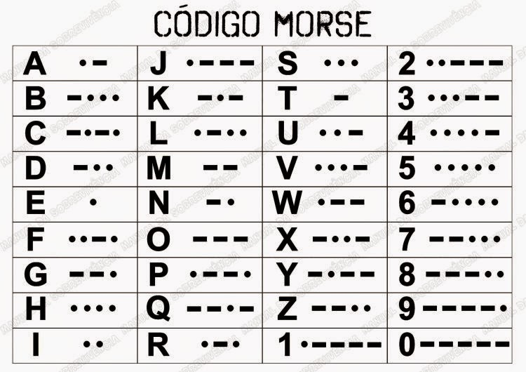

<h1>Desafios CodeWars</h1>
<p>O <a href='https://www.codewars.com/dashboard'>Codewars</a> é uma plataforma que fornece problemas, dos quais você precisa resolve-los com código. Esse repositório reúne alguns dos meus códigos que fiz enquanto explorava o site.
<br>
<h2>Decodificador de código morse</h2>
<h3>Descrição 📜</h3>
<p>Código que transforma escritas em morse para texto legível. Foi feito baseado num desafio do <a href='https://www.codewars.com/kata/54b724efac3d5402db00065e'>Codewars</a>.
<br>
<h3>Como usar:</h3>
<p>Para traduzir um texto morse, basta chamar a função decodeMorse() passando seu código em morse como parâmetro. Para fazer um teste, basta imprimir no console o chamado da função.
<br>
Ao passar o código morse, é preciso se atantar a algumas regras: cada letra do texto é separada por um espaço, e cada palavra é separada por três espaços.
</p>
<h3>Exemplo:</h3>

```bash
console.log(decodeMorse('--- ..   -.. .- ...- ..'))
// OI DAVI
```

<hr>
<h2>Tabela código morse</h2>

<hr>
<h2>Testes matemáticos</h2>
<h3>Descrição 📜</h3>
<p>Diz se um determinado número é primo, par e/ou múltiplo de 10. <a href='https://www.codewars.com/kata/5507309481b8bd3b7e001638/'>Link do desafio no codeWars</a> </p>.
<hr>
<h2>Baixando o repositório:</h2>
<p>Por ser apenas um arquivo e de poucas linhas, você pode optar por copiar e colar, caso o contrário, também pode baixar na sua máquina com o uso da ferramenta <a href='https://git-scm.com/'>Git</a>. Recomenda-se o uso de um editor de código como o <a href='https://code.visualstudio.com/'>Vscode</a>.</p>

```bash
#Clone o repositório
git clone https://github.com/davimoreiraa/codeWars.git

#Entre no repositório baixado
cd morse-decoder
```

<hr>
<footer>
  <p style='font-size:17px'>🍊 Made by Davi Moreira | See my 
    <a href="https://www.linkedin.com/in/davi-moreira-dos-santos-804280203/">LinkedIn</a>
  </p>
</footer>
